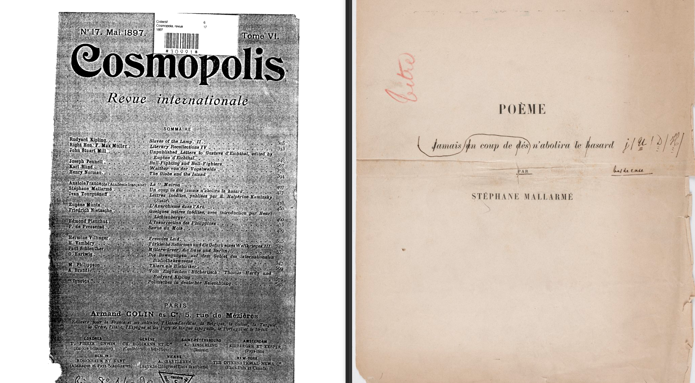
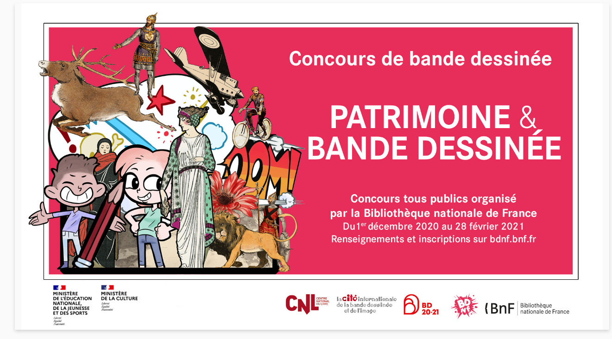

# De la BNF à Gallica

### Les mutation de la patrimonialisation littéraire

§§§§§§§§§§§§§§§§§§§§§§§§§§§§§§§§§§§§§§§§§§§§§

## Patrimoine, patrimonialisation ?

Comment définiriez-vous ces deux termes ?

§§§§§§§§§§§§§§§§§§§§§§§§§§§§§§§§§§§§§§§§§§§§§
<!-- .slide: data-background-image="img/nuage.png" data-background-size="contain" -->

§§§§§§§§§§§§§§§§§§§§§§§§§§§§§§§§§§§§§§§§§§§§§

### Patrimoine (CNTRL)

1. Ensemble des biens hérités des ascendants ou réunis et conservés pour être transmis aux descendants. Synon. héritage, legs, succession.Riche patrimoine; patrimoine héréditaire; patrimoine paternel, maternel; constituer, accroître, transmettre un/son patrimoine.

2. P. anal., BIOL. Patrimoine génétique, héréditaire (d'un individu). Ensemble des gènes transmis à un individu par ses parents.

3. P. anal ou au fig. [En parlant d'un trait de caractère, d'un comportement, de valeurs mor., culturelles, etc.] Ce qui est transmis à une personne, une collectivité, par les ancêtres, les générations précédentes, et qui est considéré comme un héritage commun. Patrimoine archéologique, artistique, culturel, intellectuel, religieux; patrimoine collectif, national, social; patrimoine d'une nation, d'un peuple.

<!-- .element: style="font-size:1.7rem; text-align:justify" -->

§§§§§§§§§§§§§§§§§§§§§§§§§§§§§§§§§§§§§§§§§§§§§

* Une notion liée à l'héritage et à la transmission (de la famille -> bien public, communautaire)
* Une notion identitaire (ce qui nous définit, ce qui est partagé avec les membres d'une même famille)
* Un bien matériel (qui tendra vers l'immatériel), mais avec une charge symbolique supplémentaire

===

La notion de patrimoine appliqué à la culture est assez complexe à saisir, car elle convoque des valeurs sensibles.

Entre passé et présent, le patrimoine est notre héritage, ce que nos ancêtres nous ont légué, mais également ce que nous avons la responsabilité de transmettre à notre tour : notre patrimoine est notre mémoire, la preuve de ce que nous avons été, ce qui nous défini aujourd'hui, ce qui nous permettra de "survivre" après notre mort.

§§§§§§§§§§§§§§§§§§§§§§§§§§§§§§§§§§§§§§§§§§§§§
<!-- .slide: data-background-image="img/deboulonnage.png" data-background-size="contain"-->

===

Depuis quelques mois, un phénomène fait parler de lui à travers le monde occidental : le déboulonnage de statues historiques. Le mouvement a commencé à Bristol, où les habitants s'en sont pris à la statue en bronze d’Edward Colston, un marchand d’esclaves de la fin du XVIIe siècle. La statue a été déboulonnée, piétinée puis noyée.

Faut-il déboulonner les statues controversées des colons, armateurs esclavagistes, etc. ?
On ne résoudra pas ici la question, mais je peux néanmoins expliquer pourquoi cette dernière est pertinente, et si sensible.

Le patrimoine est en effet tiraillé entre sa dimension purement historique (dimension testimoniale, effet de preuve ou d'archive) et une dimension symbolique (dimension "monumentale", dans les deux sens du terme dans le cas présent).

§§§§§§§§§§§§§§§§§§§§§§§§§§§§§§§§§§§§§§§§§§§§§

>Au-delà des revendications antiracistes affichées, les actes actuels de vandalisme, de déboulonnage et de destruction de statues ont un point commun : évacuer des lieux publics une mémoire historique contestée. Ces actes s’effectuent donc sur fond de remise en question de l’histoire « officielle » en opposition à une « autre » histoire que la rue revendique d’écrire, ou du moins de mettre en exergue. Loin d’être anodine, cette situation réveille la question de la fabrique de l’histoire, surtout dans des circonstances de représentation en objet mémoriel de certains personnages historiques dans l’espace public.

<!-- .element: style="font-size:1.7rem; text-align:justify" -->

source : Erick Cakpo, "Vandalisme et déboulonnage de statues mémorielles : l’histoire à l’épreuve de la rue"

<!-- .element: class="source" -->

===

Ce tiraillement est à l'image de l'Histoire, et de la mémoire elle-même, qui sont avant tout des constructions, auxquelles ont accorde cependant une légitimité très forte, au risque de la confondre avec le réel.

À cet égard, on commencera par reconnaître que le patrimoine n'est pas un élément donné en soit, mais une **construction**. Il fait donc sans doute davantage sens de parler **du processus de patrimonialisation** que du patrimoine lui-même.

§§§§§§§§§§§§§§§§§§§§§§§§§§§§§§§§§§§§§§§§§§§§§

* Le patrimoine n'est pas "donné" mais prélevé, sélectionné, construit (pas d'exhaustivité)
* Penser le processus de patrimonialisation plutôt que le terme de patrimoine (figé)

>La patrimonialisation est le processus socio-culturel, juridique ou politique par lequel un espace, un bien, une espèces ou une pratique se transforment en objet du patrimoine naturel, culturel ou religieux digne de conservation et de restauration.

<!-- .element: style="font-size:1.7rem; text-align:justify" -->

§§§§§§§§§§§§§§§§§§§§§§§§§§§§§§§§§§§§§§§§§§§§§

## Patrimoine culturel (définition UNESCO)

>Le patrimoine culturel est, dans son sens le plus large, à la fois un produit et un processus qui fournit aux sociétés
un ensemble de ressources héritées du passé, créées dans le présent et mises à disposition pour le bénéfice des
générations futures. Il comprend non seulement le patrimoine matériel, mais aussi le patrimoine naturel et immatériel.

===

Le patrimoine culturel se définit comme l'ensemble des biens, matériels ou immatériels, ayant une importance artistique et/ou historique certaine, et qui appartiennent soit à une entité privée (personne, entreprise, association, etc.), soit à une entité publique (commune, département, région, pays, etc.).

§§§§§§§§§§§§§§§§§§§§§§§§§§§§§§§§§§§§§§§§§§§§§

## Action patrimoniale
* Sélection / Prélèvement
* Préservation / Conservation / Protection / Sauvegarde / Restauration
* Exposition au public (régulière ou exceptionnelle ; gratuite ou payante)

§§§§§§§§§§§§§§§§§§§§§§§§§§§§§§§§§§§§§§§§§§§§§

## Les origines de la patrimonialisation

* Lumières (XVIIIe siècle) : sous la Révolution, organisation du catalogage et de la conservation des oeuvres et livres confisqués.
* Après la Première Guerre Mondiale (1922) : création de la *Commission internationale de coopération intellectuelle* (Bergson)
* Après la Seconde Guerre Mondiale (1945) : création de l'UNESCO

===

L'histoire du patrimoine culturel commence assez tard, à partir du siècles des Lumières (18e). On notera qu'elle est étroitement liée aux menaces qui ont pesé sur le dit patrimoine, et qu'elle s'est en quelque sorte érigée sur un champ de ruine.

Ainsi, paradoxalement, c'est le  la Révolution Française qui va lancer le mouvement de patrimonialisation. On sait que la Révolution française a engendré son lot de destruction, notamment de certains édifices et symboles religieux ; pourtant, les révolutionnaires vont également se préoccuper de protéger certains bien culturels confisqués (aux instances religieuses, mais aussi à d'autres catégories de la population : les émigrés, les nobles, etc.). En particulier, les objets d'art et les livres sont protégés de la vente et leur conservation est organisée : des dépôts révolutionnaires sont créés dans chaque département, des comités successifs sont chargés de s'assurer du traitement des livres qui font l'objet de circulaires et de conseils concernant leur conservation et leur catalogage.

Le XXe siècle s'ouvre sur un événement de destruction majeur international : la première guerre mondiale. Le philosophe Henri Bergson créée en 1922 la *Commission internationale de coopération intellectuelle*, chargée de réunir des intellectuels et savant pour favoriser les échanges culturels et intellectuels entre les nations. Parmi les membres de cette commission : de grandes personnalités comme Albert Einstein ou Marie Curie.

Cette commission est l'ancêtre de l'UNESCO, qui sera créée à l'issue de la seconde guerre mondiale.

§§§§§§§§§§§§§§§§§§§§§§§§§§§§§§§§§§§§§§§§§§§§§

## L'UNESCO : une institution patrimoniale internationale
* Acronyme "Organisation des Nations unies pour l'éducation, la science et la culture"
* Création de la Convention pour la protection du patrimoine mondial, culturel et naturel (près de 200 pays signataires)
* Extension du sens du terme "patrimoine"

===

Organisation des Nations unies pour l'éducation, la science et la culture.

L'UNESCO a pour objectif de favoriser la paix entre les peuples, par le biais des échanges culturels et de l'éducation :

> « contribuer au maintien de la paix et de la sécurité en resserrant, par l’éducation, la science et la culture, la collaboration entre nations, afin d’assurer le respect universel de la justice, de la loi, des droits de l'Homme et des libertés fondamentales pour tous, sans distinction de race, de sexe, de langue ou de religion, que la Charte des Nations unies reconnaît à tous les peuples »

Concrètement, l'action de l'UNESCO s'est d'abord traduite par la création d'un texte juridique (Convention pour la protection du patrimoine mondial, culturel et naturel) engageant les États signataires à protéger les sites et les monuments dont la sauvegarde concerne l'humanité. Au 31 janvier 2017, 193 pays sont signataires de la Convention.

En France, le décret du 10 février 1976 officialise la Convention pour la protection du patrimoine mondial, culturel et naturel adoptée par la 17e conférence de l’UNESCO le 16 novembre 1972.

L'UNESCO va aussi oeuvrer à l'extension du sens du concept de patrimoine :  Au départ, l'expression patrimoine culturel désigne principalement le patrimoine matériel (sites, monuments historiques, œuvres d'art…). L'UNESCO a établi en 1972 une liste du patrimoine mondial, composée de plusieurs centaines de sites dans le monde.

§§§§§§§§§§§§§§§§§§§§§§§§§§§§§§§§§§§§§§§§§§§§§

## Patrimoine matériel
Le patrimoine matériel rassemble notamment les éléments architecturaux remarquables, les sites historiques ainsi que le patrimoine écrit et graphique.

§§§§§§§§§§§§§§§§§§§§§§§§§§§§§§§§§§§§§§§§§§§§§

## Patrimoine immatériel

Le patrimoine culturel immatériel (PCI) englobe des pratiques et savoirs dont chacun hérite **en commun**, et qu'il s'efforce collectivement de **faire vivre, recréer et transmettre**.

===
Ce patrimoine comprend :
- savoir-faire ;
- pratiques rituelles ;
- musiques et danses ;
- pratiques festives ;
- pratiques physiques traditionnelles ;
- jeux ;
- expressions et traditions orales.

§§§§§§§§§§§§§§§§§§§§§§§§§§§§§§§§§§§§§§§§§§§§§
<!-- .slide: data-background-image="img/560px-Renoir14.jpg"  -->

===

Exemple en France: le repas gastronomique, mais aussi les carnavals de certaines villes (Granville), l'Alpinisme, savoir-faire en parfumerie, le Le gwoka (=musique, chants, danses et pratique culturelle représentatifs de l'identité guadeloupéenne).

§§§§§§§§§§§§§§§§§§§§§§§§§§§§§§§§§§§§§§§§§§§§§

## Patrimoine littéraire ?
Les bibliothèques sont en charge de la conservation du patrimoine littéraire, qui peut comprendre de nombreux types de documents et d'artefacts : les objets écrits et graphiques (manuscrits, ouvrages, brouillons...), des enregistrements (audio, vidéo), des archives personnelles, des journaux...

===

En France, les bibliothèques municipales (et la BNF) sont en charge de la conservation du patrimoine littéraire, qui peut comprendre de nombreux types de documents et d'artefacts, excédant le périmètre de ce que l'on entend traditionnellement par littérature en classe : les objets écrits et graphiques (manuscrits, ouvrages, brouillons...), des enregistrements (audio, vidéo), des archives personnelles, des journaux... Outre les "oeuvres" littéraires, c'est en fait la vie littéraire que les institutions doivent conserver et transmettre.

§§§§§§§§§§§§§§§§§§§§§§§§§§§§§§§§§§§§§§§§§§§§§

## Qu'est-ce que l'on patrimonialise ?
* Ce qui est "digne" de conservation ou de restauration
* Un périmètre fluctuant
* Des règles discutables (et discutées)
* Préserver le passé tout en pensant l'avenir

===

§§§§§§§§§§§§§§§§§§§§§§§§§§§§§§§§§§§§§§§§§§§§§

## Qui patrimonialise ?
* Des institutions (Bibliothèques, Institut national du patrimoine, UNESCO, etc.)
* Des personnels qualifiés : bibliothécaires, documentalistes, conservateurs, ABF, etc.

===

§§§§§§§§§§§§§§§§§§§§§§§§§§§§§§§§§§§§§§§§§§§§§

## Pour qui patrimonialise-t-on ?
* Les générations futures
* Le grand public
* Un accès parfois réservé aux experts (chercheurs, historiens, etc.)

===

§§§§§§§§§§§§§§§§§§§§§§§§§§§§§§§§§§§§§§§§§§§§§

#### Problématique : Comment l'évolution des pratiques patrimoniales issues de la transition numérique renouvelle-t-elle l'implication des publics et, par extension, le statut des objets patrimoniaux ?

===

On l'a vu en CM, le développement des technologies numériques va bouleverser la fabrique du patrimoine. Face à une "Boulimie" liée au potentiel de numérisation, qui se traduit par :
  - 1. le fantasme d'une mémoire infinie (résolution des problèmes de stockage -- qui s'est avérée finalement bien plus problématique qu'auparavant)
  - 2. l'utopie d'une accessibilité sans frontières (politiques de numérisation massives, open access, etc.)

les pratiques de patrimonialisation ont largement évolué, entraînant une redéfinition du concept de patrimoine, dont on va voir qu'il se décline désormais sous le paradigme de l'ouverture.

L'étude que nous allons proposer dans ce TD et les prochaines séance traite du sujet suivant : quelle évolution des pratiques de patrimonialisation se dessine avec l'essor des technologies numériques ?

Ce sujet nous sert à traiter la problématique suivante : Comment cette évolution renouvelle-t-elle l'implication des publics et, par extension, le statut des objets patrimoniaux ?

Si l'on a déjà dit à plusieurs reprises que les médiations numériques favorisaient une autorité horizontale plutôt que verticale, en favorisant l'implication croissante des publics, il s'agit alors de comprendre les implication d'un tel changement de paradigme sur la construction des patrimoines et de notre mémoire : sommes-nous tous devenus acteurs de la patrimonialisation ?

Pour traiter ce sujet, on prendre pour exemple le cas de notre Bibliothèque nationale, la BNF.

§§§§§§§§§§§§§§§§§§§§§§§§§§§§§§§§§§§§§§§§§§§§§

## Les évolutions de la patrimonialisation littéraire : le cas BNF

===

§§§§§§§§§§§§§§§§§§§§§§§§§§§§§§§§§§§§§§§§§§§§§
<!-- .slide: data-background-image="img/BNF.jpg" data-background-size="contain" -->

===

La Bibliothèque nationale de France est sans doute la Bibliothèque la plus importante en France, notamment en raison de la richesse de ses collections, mais aussi car elle est en charge du dépôt légal (def. à venir).

Actuellement, elle est répartie sur plusieurs sites, dont le plus important et le plus connu est la bibliothèque du site François-Mitterrand, située dans le 13e arrondissement.

>La BnF a une mission de collecte, d’archivage et d’entretien (conservation, restauration), en particulier de tout ce qui se publie ou s'édite en France, ainsi que du patrimoine hérité des collections antérieures et reçu par d'autres voies (dons, legs, achats), mais aussi des activités de recherche et de diffusion de la connaissance, grâce notamment à l’organisation régulière d’expositions à destination du grand public et de multiples manifestations culturelles, conférences, colloques, concerts, dans ses locaux et sur son site Internet.

La BNF tire son origine de la bibliothèque (librairie) du roi, installée en 1368 au Louvre par Charles V. Elle conserve donc un héritage ancien, qui remonte au Moyen Âge.

§§§§§§§§§§§§§§§§§§§§§§§§§§§§§§§§§§§§§§§§§§§§§
<!-- .slide: data-background-image="img/salle-lecture-BnF-Francois-Mitterrand-novembre-2018_0.jpg" data-background-size="contain" -->

===

La BNF accueille chaque jour des chercheurs dans un espace réservé, au RDC de la Biblio François Mittérand dans le 13e. Pour y accéder, il faut avoir + 18 ans ainsi qu'un passe de recherche.

§§§§§§§§§§§§§§§§§§§§§§§§§§§§§§§§§§§§§§§§§§§§§

### La Bibliothèque Nationale de France (BNF) en 3 âges
* XXe siècle : le temps de la conservation (autour du film d'Alain Resnais "Toute la mémoire du monde")
* XX-XXIe siècle : le temps de la numérisation (découvrir Gallica)
* XXIe siècle : le temps de l'éditorialisation (l'application BDNF)

§§§§§§§§§§§§§§§§§§§§§§§§§§§§§§§§§§§§§§§§§§§§§

### "Toute la mémoire du monde" : le temple de la patrimonialisation
* Alain Resnais (1922-2014), cinéaste Français
* Mouvement = Nouvelle Vague
* *Nuit et Brouillard*, *Hiroshima mon amour*, *Smoking / No Smoking*
* *Toute la mémoire du monde*, documentaire et court métrage sur la BNF (1956)

§§§§§§§§§§§§§§§§§§§§§§§§§§§§§§§§§§§§§§§§§§§§§
<!-- .slide: data-background-video="img/ResnaisTouteLaMemoireDuMonde.mp4" -->

===

film Resnais

§§§§§§§§§§§§§§§§§§§§§§§§§§§§§§§§§§§§§§§§§§§§§

#### Selon vous, quel est le sens du titre du film "Toute la mémoire du monde" ?

§§§§§§§§§§§§§§§§§§§§§§§§§§§§§§§§§§§§§§§§§§§§§

* Quantitatif => Une collecte présentée comme exhaustive (3 millions de documents par siècle)
* Qualitatif => Un fonds qui recèle des trésors (la première publication de Rimbaud)

===

La mémoire est présentée de manière ironique comme un fardeau. Resnais insiste sur la quantité exponentielle de documents créés, si bien que nous ne pouvons tout connaître. La Bib vient se substituer à notre mémoire.

À cette présentation quantitative s'ajoute des critères qualitatifs : la BN regorge de trésors. L'accent n'est pas seulement mis sur la quantité mais sur la qualité. L'utilité des documents n'est pas essentielle : si un seul document n'est consulté qu'une fois, alors sa conservation reste utile.

§§§§§§§§§§§§§§§§§§§§§§§§§§§§§§§§§§§§§§§§§§§§§

#### En quels termes la BNF est-elle décrite ? Comment est-elle filmée ?
#### Quelle image de l'institution se dégage de ces choix ?

§§§§§§§§§§§§§§§§§§§§§§§§§§§§§§§§§§§§§§§§§§§§§

* La BNF "Forteresse de la mémoire", des mots "emprisonnés"
* Des choix cinématographiques austères : une bibliothèque peuplée de livres et de statues, peu de "personnes" (ou alors elles-mêmes statufiées ou filmées de loin - aucun témoignage)
* Une musique aux accents dramatiques - monumentalisation

§§§§§§§§§§§§§§§§§§§§§§§§§§§§§§§§§§§§§§§§§§§§§

* Une institution sérieuse, sacralisée, presque inquiétante.

§§§§§§§§§§§§§§§§§§§§§§§§§§§§§§§§§§§§§§§§§§§§§

#### Quels sont les objets du patrimoine conservés à la BNF ?

§§§§§§§§§§§§§§§§§§§§§§§§§§§§§§§§§§§§§§§§§§§§§

* Manuscrits
* Textes imprimés
* Estampes
* "Médailles" & objets précieux (monnaies, etc.)
* Cartes & Plans

§§§§§§§§§§§§§§§§§§§§§§§§§§§§§§§§§§§§§§§§§§§§§

#### Qu'est-ce que le dépôt légal ?

§§§§§§§§§§§§§§§§§§§§§§§§§§§§§§§§§§§§§§§§§§§§§

#### Dépôt légal

>Au titre du dépôt légal, la BnF reçoit par dépôt légal des documents de toute nature édités, importés ou diffusés en France. Instauré en 1537 par François Ier, le dépôt légal est régi par le Code du patrimoine. il s’étend aux livres, périodiques, documents cartographiques, musique notée, documents graphiques et photographiques, mais aussi aux documents sonores, vidéogrammes, documents multimédias, et depuis 2006 aux sites web et aux documents dématérialisés : logiciels, bases de données.

<!-- .element: style="font-size:1.7rem; text-align:justify" -->

§§§§§§§§§§§§§§§§§§§§§§§§§§§§§§§§§§§§§§§§§§§§§

#### En quoi la BNF est-elle "moderne" et à la pointe de la technique ?

§§§§§§§§§§§§§§§§§§§§§§§§§§§§§§§§§§§§§§§§§§§§§
<!-- .slide: data-background-image="img/BNF1.png" data-background-size="contain" -->

===

"dénombrer, classer, inventorier"...

§§§§§§§§§§§§§§§§§§§§§§§§§§§§§§§§§§§§§§§§§§§§§
<!-- .slide: data-background-image="img/BNF2.png" data-background-size="contain" -->

§§§§§§§§§§§§§§§§§§§§§§§§§§§§§§§§§§§§§§§§§§§§§
<!-- .slide: data-background-image="img/BNF3.png" data-background-size="contain" -->

§§§§§§§§§§§§§§§§§§§§§§§§§§§§§§§§§§§§§§§§§§§§§
<!-- .slide: data-background-image="img/pneu.png" data-background-size="contain" -->

===

>C’est le système pneumatique qui permettait aux bibliothécaires d’antan d’envoyer les demandes de documents dans les services concernés. Un système à air comprimé, qui propulsait des navettes tubulaires contenant les messages à plus de 400 m par minute. Installé en 1935, utilisé jusqu’en 1998, date de déménagement des collections dans la BnF François-Mitterrand, il constitue un élément de décor décalé au milieu des ordinateurs qui l’ont remplacé.

>Ce système de communication était incontournable dans toutes les capitales du monde à la fin du XIXe et au début du XXe siècle. Et pas seulement en bibliothèque ! C’était le mode de transport du courrier public, mis en place dès 1866 à Paris. En 1888, près de 200 km de tubes posés dans les égouts reliaient les bureaux télégraphiques de la capitale.

§§§§§§§§§§§§§§§§§§§§§§§§§§§§§§§§§§§§§§§§§§§§§
<!-- .slide: data-background-image="img/pneu2.jpeg" data-background-size="contain" -->

§§§§§§§§§§§§§§§§§§§§§§§§§§§§§§§§§§§§§§§§§§§§§
<!-- .slide: data-background-image="img/nemo.png" data-background-size="contain" -->

===

qui est Nemo chez Jules Verne ? COmment interpréter cette comparaison littéraire ? Verne = écrivain de la technique, scientisme au XIXe

§§§§§§§§§§§§§§§§§§§§§§§§§§§§§§§§§§§§§§§§§§§§§

* Un espace en évolution perpétuelle (sous terre et sur terre)
* Un travail de catalogage à la pointe de la science (des "disciplines aux lois")
* Des techniques au service de l'efficacité (microfilms, système de communication à air comprimé)
* Comparaison avec l'imaginaire de Verne (Nemo)

§§§§§§§§§§§§§§§§§§§§§§§§§§§§§§§§§§§§§§§§§§§§§

#### Comment est représenté le public de la BNF dans le film de Resnais ?

§§§§§§§§§§§§§§§§§§§§§§§§§§§§§§§§§§§§§§§§§§§§§
<!-- .slide: data-background-image="img/BNF_1.png" data-background-size="contain" -->

§§§§§§§§§§§§§§§§§§§§§§§§§§§§§§§§§§§§§§§§§§§§§
<!-- .slide: data-background-image="img/BNF_2.png" data-background-size="contain" -->

§§§§§§§§§§§§§§§§§§§§§§§§§§§§§§§§§§§§§§§§§§§§§

* Un film centré autour des trésors de la BNF, livres rares, etc.
* Le scénario suit le circuit du livre
* Les "Lecteurs" apparaissent brièvement à la fin, sans plus de détails
* Des "faux insectes croqueurs de papier"

§§§§§§§§§§§§§§§§§§§§§§§§§§§§§§§§§§§§§§§§§§§§§

### Conclusion provisoire
Dans le film d'Alain Resnais, l'image de la BNF est encore celle d'un temple de la conservation entièrement centré autour des oeuvres, elles-mêmes sacralisées. Le public est le grand absent de cette présentation de l'institution, qui apparaît comme la gardienne de notre mémoire -- sans que celle-ci soit questionnée. La BN apparaît également comme un espace à la pointe de la technologie, au service de la préservation des oeuvres. Nous sommes dans un paradigme de la monumentalisation.

§§§§§§§§§§§§§§§§§§§§§§§§§§§§§§§§§§§§§§§§§§§§§

## Gallica : le temps de la numérisation

§§§§§§§§§§§§§§§§§§§§§§§§§§§§§§§§§§§§§§§§§§§§§
<!-- .slide: data-background-image="img/gallica2.png" data-background-size="contain" -->

===

Gallica est la bibliothèque numérique de la Bibliothèque nationale de France. En ligne depuis 1997, elle s’enrichit chaque semaine de milliers de nouveautés et offre aujourd’hui accès à plusieurs millions de documents.

* à l'origine, un projet de bibliothèque virtuelle : des ordi mis à disposition dans la Bibli, depuis lesquels on aurait eu accès à des oeuvres numérisées
* dans les années 1990, l'essor du web modifie le projet : désormais, la bibliothèque virtuelle se trouvera en ligne, et on pourra la consulter depuis chez soi.
* Ouverture = 1997

§§§§§§§§§§§§§§§§§§§§§§§§§§§§§§§§§§§§§§§§§§§§§

### Rendez-vous sur la *home* de Gallica
- À quelle forme médiatique cette page d'accueil fait-elle penser?
- Que pensez-vous des contenus mis en avant?

§§§§§§§§§§§§§§§§§§§§§§§§§§§§§§§§§§§§§§§§§§§§§
<!-- .slide: data-background-image="img/gallica03.png" data-background-size="contain" -->

===

La première section = "Les actualités".
Inscription très forte dans l'idée d'une bibliothèque vivante.

Sur le plan des contenus, la home joue le rôle d'une interface de médiation entre les collections et le public. On note une opération de traitement de l'actualité de la bibliothèque, dans le domaine de la culture et des lettres avec :
- des liens avec l'actualité générale / fais divers = ici, un papier sur les origines et représentations de la galette des rois...
- des dossiers thématiques qui relèvent de la curation de contenu. Curation = pratique qui consiste à sélectionner, éditer et partager les contenus les plus pertinents. Il s'agit d'une activité propres aux documentalistes, archivistes et tous ceux qui s'occupent de la valorisation du patrimoine.
- des appels à projets participatifs = ici un concours de coloriage des collections

§§§§§§§§§§§§§§§§§§§§§§§§§§§§§§§§§§§§§§§§§§§§§
<!-- .slide: data-background-image="img/voltaireMontage.png" data-background-size="contain" -->

===

Formellement, la home se présente comme un magazine web, avec une présentation très graphique, différents blocs image-texte qui constituent des portes d'entrée vers la collection numérisée à proprement parler.

On retrouve le design de la presse numérique grand public.

§§§§§§§§§§§§§§§§§§§§§§§§§§§§§§§§§§§§§§§§§§§§§
<!-- .slide: data-background-image="img/gallica04.png" data-background-size="contain" -->

===

Dans les sections suivantes, accessibles en scroll, des contenus davantage ciblés vers des types de public particuliers :
- contenus didactiques et pédagogiques pour les écoles
- contenus pour enfants

§§§§§§§§§§§§§§§§§§§§§§§§§§§§§§§§§§§§§§§§§§§§§

* Un travail éditorial important (sélection et curation de contenus), emprunté au modèle du magazine web
* Une page d'accueil conçue comme une porte d'entrée vers l'interface de lecture des contenus numérisés
* Une pré-sélection par publics pour médier les contenus

§§§§§§§§§§§§§§§§§§§§§§§§§§§§§§§§§§§§§§§§§§§§§

### Effectuez une recherche au hasard sur Gallica
* Quels sont les outils à votre disposition pour effectuer cette recherche ?
* Quelle est la différence entre la modalité « recherche avancée » et les onglets de la page d’accueil? Ces deux outils ont-ils la même fonction et s’adressent-ils au même public?
* Quelle est la différence fondamentale avec l’ancien système de la BNF, comme on a pu l’observer dans le film d’Alain Resnais ?

===

Prenez en main la plateforme pour effectuer des recherches. Vous constaterez que la plateforme propose plusieurs méthodes, qui dessinent des parcours de lecture différents.

Effectuez quelques recherches sur Gallica, que vous ayez une idée précise ou non de ce que vous cherchez.
Quelle est votre méthodologie ?

§§§§§§§§§§§§§§§§§§§§§§§§§§§§§§§§§§§§§§§§§§§§§
<!-- .slide: data-background-image="img/gallica03.png" data-background-size="contain" -->

===

Plusieurs outils :
\1. la page d'accueil présente déjà une première sélection comprenant des portes d'entrée vers des contenus de la collection, des oeuvres numérisées. On a vu que cette page d'accueil insistait sur des contenus en phase avec l'actualité, ou s'adressait directemen à des publics précis, ou encore qu'elle mettait en avant des activités ludiques (type concours).

§§§§§§§§§§§§§§§§§§§§§§§§§§§§§§§§§§§§§§§§§§§§§
<!-- .slide: data-background-image="img/thematique.png" data-background-size="contain" -->

===
\2. plusieurs parcours thématiques sont également proposés, pour des recherches un peu plus poussées : on y accède via les onglets qui catégorisent différents angles de recherche.

Il s'agit alors de présenter des collections et de proposer des navigations à travers des regroupements spécifiques, selon des catégories qui constituent des portes d'entrées vers les contenus numérisés :
- approche thématique
- approche chronologique
- approche par personnalité
- approche géographique
- approche par type de document

§§§§§§§§§§§§§§§§§§§§§§§§§§§§§§§§§§§§§§§§§§§§§
<!-- .slide: data-background-image="img/cartographie.png" data-background-size="contain" -->

===

Ces approches proposent pour certaines des visualisations du corpus, c'est-à-dire des modes de représentation permettant de faire émerger du sens à partir d'un vaste ensemble de données, en s'appuyant sur les métadonnées des objets conservés. Par exemple : l'exploration géographique.

§§§§§§§§§§§§§§§§§§§§§§§§§§§§§§§§§§§§§§§§§§§§§
<!-- .slide: data-background-image="img/catalogue.png" data-background-size="contain" -->

===
\3. un moteur de recherche avancée directement branché au catalogue, avec une série de filtres, pour une recherche précise, qui requiert des compétences méthodologiques en recherche

§§§§§§§§§§§§§§§§§§§§§§§§§§§§§§§§§§§§§§§§§§§§§
### Trois parcours de lecture
* Parcours "découverte" : la page d'accueil (aucune maîtrise de l'interface requise, consultation limitée)
* Parcours de "flâneur" : l'exploration du corpus par catégories [thématique, aire géographique] (public curieux d'approfondir des connaissances ou de découvrir de nouveaux contenus)
* Parcours "expert" : le moteur de recherche avancée (public averti, qui sait ce qu'il cherche)

===
Ces trois méthodo renvoient à différents usages de la plateforme, et sans doute à différents lecteurs. On pense à nos persona en médiathèque ou en édition.

§§§§§§§§§§§§§§§§§§§§§§§§§§§§§§§§§§§§§§§§§§§§§
<!-- .slide: data-background-image="img/numerisationCatalogue.png" data-background-size="contain" -->

===

Le catalogue - cf. salle des catalogues dans le film de resnais - a été entièrement informatisé.
Développer les implications en termes de recherche.

§§§§§§§§§§§§§§§§§§§§§§§§§§§§§§§§§§§§§§§§§§§§§

### Effectuez une recherche ciblée sur Gallica
>a. « Jamais un coup de dés n'abolira le hasard », par Stéphane Mallarmé, Cosmopolis (revue internationale), 1897.  

>b. « Jamais un coup de dés n'abolira le hasard », poème : [épreuves d'imprimerie], par Stéphane Mallarmé [avec trois lithographies d'Odilon Redon], 1897.  

===

https://gallica.bnf.fr/ark:/12148/btv1b8625644w/f1.item

https://gallica.bnf.fr/ark:/12148/bpt6k309916.r=revue%20cosmopolis%201897?rk=107296;4

§§§§§§§§§§§§§§§§§§§§§§§§§§§§§§§§§§§§§§§§§§§§§

* Quel outil et quelle méthode de recherche avez-vous utilisé ?
* Explorez l’interface : que pouvez-vous faire avec ces documents (annoter, copier-coller, télécharger…) ? Vous semble-t-elle facile à manier?
* Que pensez-vous de la qualité de la numérisation?

§§§§§§§§§§§§§§§§§§§§§§§§§§§§§§§§§§§§§§§§§§§§§
<!-- .slide: data-background-image="img/mallarme_vollard3.png" data-background-size="contain" -->

§§§§§§§§§§§§§§§§§§§§§§§§§§§§§§§§§§§§§§§§§§§§§
<!-- .slide: data-background-image="img/mallarme_vollard2.png" data-background-size="contain" -->

§§§§§§§§§§§§§§§§§§§§§§§§§§§§§§§§§§§§§§§§§§§§§
<!-- .slide: data-background-image="img/mallarme_vollard1.png" data-background-size="contain" -->

§§§§§§§§§§§§§§§§§§§§§§§§§§§§§§§§§§§§§§§§§§§§§

* Consultation des métadonnées (volet de gauche)
* Navigation dans l'oeuvre (conservation de la lecture par "feuilletage")
* Un texte disponible en format image (une manipulation du texte complexe)
* Téléchargement pour impression / commande de fac simile

§§§§§§§§§§§§§§§§§§§§§§§§§§§§§§§§§§§§§§§§§§§§§

* Selon vous, à qui s’adresse cette plateforme?

Une lecture "avertie" des documents à disposition, principalement pour des chercheurs, amateurs ou professionnels, ou étudiants.

===

§§§§§§§§§§§§§§§§§§§§§§§§§§§§§§§§§§§§§§§§§§§§§

### À quoi cela sert-il de conserver le patrimoine littéraire ? Le cas Mallarmé

<!-- .element: style="width:30%; border: 2px black; align=center" -->

===

« Jamais un coup de dé n’abolira le hasard » est un texte réputé complexe, auquel des ouvrages entiers ont été consacrés. Le texte déploie une sorte de prose poétique difficile à déchiffrer (il est question d'un naufrage, notamment), déployée dans l'espace médiatique du livre et de la page, ce qui n'est pas sans rappeler à l'occasion l'esthétique du calligramme.

Dans l'imaginaire collectif, mais aussi chez les spécialistes, une idée circule, selon laquelle ce texte renfermerait un code secret, que les chercheurs ou amateurs ont tenté de percer depuis des années.

Publié en 1897, « Jamais un coup de dé n’abolira le hasard » est l'aboutissement du projet esthétique de Mallarmé, qui publie le texte à la fin de sa vie. Il s'agit du dernier gros chantier poétique de l'écrivain, qui ne verra jamais son oeuvre achevée.

Le mythe du sens caché de l'oeuvre est d'autant plus forte que c'est une oeuvre "inachevée". L'histoire éditoriale de ce texte a par ailleurs soutenu ce mythe.

En effet, il existe une première version du poème : celle de la revue Cosmopolis, dont Mallarmé n'était pas satisfait. Il a passé les derniers mois de sa vie à travailler sur une autre édition, dont vous avez pu consulter les épreuves sur le site de la BNF. Cette édition est toujours restée à l'état d'épreuves : elle n'a jamais été commercialisée et a été longtemps oubliée. Pourtant, elle est précieusement conservée à la BNF.

§§§§§§§§§§§§§§§§§§§§§§§§§§§§§§§§§§§§§§§§§§§§§

<!-- .slide: data-background-image="img/comparatif_mallarme5.png" data-background-size="contain" -->

===

Quelle est la différence entre ces documents ?
Différence de nature :
- une publication originale dans une revue littéraire (*Cosmopolis*)
- une épreuve d'imprimerie (soit un document de travail)

Différences de forme :
- pas la même disposition sur la page
- pas la même typographie (Garamond vs Didot)
- pas la même graisse

§§§§§§§§§§§§§§§§§§§§§§§§§§§§§§§§§§§§§§§§§§§§§

* 1ère édition dans la Revue *Cosmopolis* (1897)
* Projet de 2e édition sous forme indépendante, par Vollard, en collaboration avec l'imprimeur Firmin-Didot (1896-97)

>Un projet éditorial oublié pendant près de 50 ans

===

• 1ère édition dans la Revue Cosmopolis. 1897 On est 2 ans avant la mort de Mallarmé - un poète en fin de vie, qui a eu le temps de nourrir son projet.
Mallarmé n'en était pas complètement satisfait. Il n'aimait pas du tout le travail typographique réalisé : la police choisie n'était pas la bonne, etc.
Il a du coup travaillé sur une autre édition, son édition idéale, le projet Vollard (du nom de l'éditeur)

• 2e édition sous forme indépendante, par Vollard, en collaboration avec l'imprimeur Firmin-Didot. http://www.coupdedes.com/rubrique4.html
En fait, il s'agit d'un projet commencé avant la publication dans *Cosmopolis* (même si cette dernière propose la première publication officielle) : 1896 - XXXX. Vollard en est l'initiateur.

De cette édition, qui était presque parfaite aux yeux du poète, nous n'avons que ces épreuves : en fait le projet n'a jamais abouti à une publication.

Il tombe ensuite dans l'oubli pendant plus de 50 ans.

Pendant des dizaines d'années, les rééditions (notamment celle de la NRF qui fait autorité) vont se caler sur la version cosmopolis.

Personne (sauf quelques proches de Mallarmé ou rares collectionneurs et libraires) n'ont eu connaissance des épreuves du projet Vollard, et tous les commentateurs cherchent à déchiffrer le poème sur l'édition héritée de Cosmopolis.

§§§§§§§§§§§§§§§§§§§§§§§§§§§§§§§§§§§§§§§§§§§§§
<!-- .slide: data-background-image="img/comparatif_mallarme2.png" data-background-size="contain" -->

===

    • La redécouverte des épreuves

La deuxième partie du XXe et le début du XXIe siècle ont vu la multiplication des éditions du Coup de Dés, dans une grande diversité de formats (de luxe ou de poche) et de typographies, certaines s’éloignant de la composition originelle au point de la rendre méconnaissable.

La même période sera aussi celle d’un lent retour aux sources et de la révélation progressive du chef-d’œuvre inconnu oublié dans les tiroirs des collectionneurs.

Il faudra attendre 1993 pour qu’un jeu complet d’épreuves soit présenté au public, sous vitrine, et reproduit intégralement dans le catalogue de l’exposition « Poésure et Peintrie » à l’ancien hospice de la Vieille Charité, à Marseille.

§§§§§§§§§§§§§§§§§§§§§§§§§§§§§§§§§§§§§§§§§§§§§
<!-- .slide: data-background-image="img/comparatif_mallarme1.png" data-background-size="contain" -->

===

    • Depuis 20 ans: les reconstitutions
Michel Pierson & Ptyx, 2004, qui utilise la Didot, comme le souhaitait mallarmé pour qui la page devait être conçue comme une toile de peinture, sur laquelle venait s'inscrire le texte.

Jamais un coup de dé n'abolira le hasard doit se lire de manière sémantique, mais aussi graphique, comme une peinture, une calligraphie, mais aussi une partition de musique (la graisse des lettre imitant les rondes sur lesquelles le lecteur doit insister).

§§§§§§§§§§§§§§§§§§§§§§§§§§§§§§§§§§§§§§§§§§§§§

### Conclusion provisoire
Si la plateforme Gallica a d'abord pour objectif de garantir l'accès à ses collections numérisées, on constate un important travail de médiation des collections, ré-organisées et présentées selon différentes catégorisations (thématiques, géographiques, etc.). On note également que cette médiation cherche à diversifier ses publics, en proposant des contenus spécialement adressés à certain.e.s lecteur/rices (enfants, classes, etc.). Cette curation des contenus, qui cherche à s'ancrer dans l'actualité, donne à la page d'accueil de Gallica des airs de média. Cela étant, la fonction première de la plateforme demeure la consultation des collections.

<!-- .element: style="font-size:1.4rem; text-align:justify" -->

§§§§§§§§§§§§§§§§§§§§§§§§§§§§§§§§§§§§§§§§§§§§§

## BDNF : vers une éditorialisation du patrimoine

<!-- .element: style="width:10%; border: 2px black; align=center" -->

§§§§§§§§§§§§§§§§§§§§§§§§§§§§§§§§§§§§§§§§§§§§§

* Comment se définit BDNF ?
* Quelle est la mission de l’application?
* L’accent est-il mis sur la conservation et la diffusion du patrimoine?

§§§§§§§§§§§§§§§§§§§§§§§§§§§§§§§§§§§§§§§§§§§§§
<!-- .slide: data-background-image="img/BDNF3.png" data-background-size="contain" -->

===
* BDNF
* Un encouragement à la réappropriation, au partage, à la création

§§§§§§§§§§§§§§§§§§§§§§§§§§§§§§§§§§§§§§§§§§§§§

* Est-ce que le dispositif semble complexe à utiliser ?

§§§§§§§§§§§§§§§§§§§§§§§§§§§§§§§§§§§§§§§§§§§§§
<!-- .slide: data-background-image="img/BDNF2.png" data-background-size="contain" -->

===

* Un outil modulaire (fonctionne sur ordinateur, tablette, téléphone...) = accessibilité ++
* Un fonctionnement simple

§§§§§§§§§§§§§§§§§§§§§§§§§§§§§§§§§§§§§§§§§§§§§

* Relevez en quoi le dispositif BDNF s’appuie sur un principe de ludification / gamification.

§§§§§§§§§§§§§§§§§§§§§§§§§§§§§§§§§§§§§§§§§§§§§
<!-- .slide: data-background-image="img/BDNF1.png" data-background-size="contain" -->

===

* Organisation de concours
* Appel à partager les contenus produits (dimension collective)

§§§§§§§§§§§§§§§§§§§§§§§§§§§§§§§§§§§§§§§§§§§§§

* À qui s’adresse l’application selon vous ?

§§§§§§§§§§§§§§§§§§§§§§§§§§§§§§§§§§§§§§§§§§§§§

* Fonction patrimoniale
  - Quelle conception de l'objet patrimonial se dégage d'une telle initiative ?

§§§§§§§§§§§§§§§§§§§§§§§§§§§§§§§§§§§§§§§§§§§§§

### Conclusion
Avec l'application BDNF, la BN achève une transition vers l'ouverture, mais surtout l'éditorialisation de ses données. Elle y gagne probablement de nouveaux publics, en particulier un public jeune (voire très jeune), mais apprend du même coup à repenser sa mission, qui ne relève plus seulement de la conservation, mais aussi de la création. En cela, elle participe à ce phénomène de réappropriation collective du patrimoine par les publics d'aujourd'hui.
