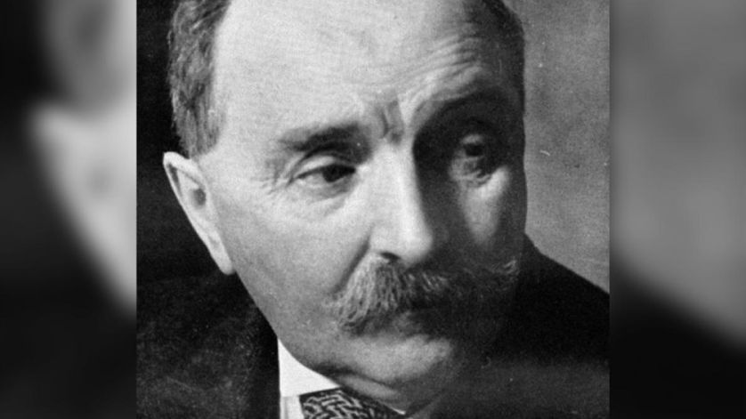

# *Booktubeur*, un métier d'avenir ?

>« J’AI LU mon nouveau COUP DE CŒUR grâce à MON SIGNE ASTROLOGIQUE »

>Jeannot se livre

§§§§§§§§§§§§§§§§§§§§§§§§§§§§§§§§§§§§§§§§§§§§§
<!-- .slide: data-background-image="img/booktubeur.png" data-background-size="contain" -->

## Booktubing ?

===

§§§§§§§§§§§§§§§§§§§§§§§§§§§§§§§§§§§§§§§§§§§§§

## Booktubing ?
* Book +Youtube
* Pratique qui consiste à faire des critiques de livres sur la plateforme YouTube

===

Terme fondé sur la contraction de « book » et de « YouTube ».
Pratique qui consiste à faire des critiques de livres sur la plateforme YouTube.
    • Nouvel avatar de la figure de l’« amateur » dont la visibilité s’est accrue avec le développement du web social.

§§§§§§§§§§§§§§§§§§§§§§§§§§§§§§§§§§§§§§§§§§§§§

<iframe width="560" height="315" src="https://www.youtube.com/embed/uFj3A0F_v38" title="YouTube video player" frameborder="0" allow="accelerometer; autoplay; clipboard-write; encrypted-media; gyroscope; picture-in-picture" allowfullscreen></iframe>

===

Jeannot se livre, « J’AI LU mon nouveau COUP DE
CŒUR grâce à MON SIGNE ASTROLOGIQUE », 22
janvier 2022.

§§§§§§§§§§§§§§§§§§§§§§§§§§§§§§§§§§§§§§§§§§§§§

### Analyse des caractéristiques médiatiques et formelles

* En quoi cette vidéo correspond-t-elle à la norme créée et adoptée par les youtubeurs ?

===

Vidéo courte, avec un montage dynamique. Ne se consacre pas à un seul livre, mais fait une courte présentation et une courte critique de quatre livres de genres différents. Format qui n’est pas celui qu’adoptent tou·te·s les booktubeur·se·s : grande variété de ce point de vue. Ici, booktubeuse qui fait le choix de la brièveté.
Booktubeuse se filme face caméra => mise en scène commune à de nombreux genres de vidéos sur YouTube (tutoriels de maquillage, unboxing…).  Mais pas de plan séquence : montage cut => coupures qui saccadent le rythme de la vidéo et accentuent l’effet de dynamisme.

§§§§§§§§§§§§§§§§§§§§§§§§§§§§§§§§§§§§§§§§§§§§§

### Analysez la posture et le discours de la booktubeuse

* Amatrice ou professionnelle ?

===

Effets de proximité : décor intime (certainement son salon), adresse directe aux spectateur·rice·s avec une volonté de fidélisation d’une communauté (« ma team Jeannot »), registre familier, anecdotes autobiographiques, tonalité légère et humoristique. Nombreuses digressions, dans lesquelles elle se moque parfois d’elle-même. Ton très oral, volonté de créer un effet de spontanéité et d’authenticité.
Thématique qui fait office de fil conducteur = externe aux livres eux-mêmes : le signe astrologique. Cette thématique sert également de prétexte à la booktubeuse pour se livrer sur elle-même.
Première personne mise en avant dès le titre de la vidéo.

Une forme de professionnalisation de la pratique amatrice : financement présenté de manière transparente par la booktubeuse. Sponsors de plus en plus fréquents, ce qui montre que les booktubeur·se·s gagnent en influence. Iels sont désormais reconnu·e·s par le milieu de l’édition comme des acteur·rice·s non négligeables du secteur. Problème : question de la confiance. Les booktubeur·se·s qui se font sponsoriser courent le risque de perdre la confiance de leur public

§§§§§§§§§§§§§§§§§§§§§§§§§§§§§§§§§§§§§§§§§§§§§

### En quoi la pratique de la lecture promue par cette vidéo se distingue-t-elle de celle qui est valorisée par les institutions scolaires et universitaires ?

===

Lectures choisies en fonction d’une pseudo-science (l’astrologie), présentée avec une certaine distance : convoquée pour sa dimension ludique, et présentée comme une croyance.
Intérêt pour des genres méprisés par les institutions scolaires et universitaires : le développement personnel, la romance.
Arguments peu développés.
Valorisation d’une lecture immersive : « intrigue amusante », « personnage auquel on s’attache », « livre hyper facile à lire ». Recours à des métaphores figées qui décrivent le phénomène de l’immersion fictionnelle : « on plonge dedans hyper facilement ». Mise en avant de l’écriture qualifiée de « top », mais davantage pour ses qualités immersives que pour ses qualités littéraires / stylistiques.

§§§§§§§§§§§§§§§§§§§§§§§§§§§§§§§§§§§§§§§§§§§§§

• Premier cercle : bavardage
• Deuxième cercle : critique professionnelle, à ambition théorique
• Troisième cercle : critique des artistes

===

Article fondé sur une opposition binaire devenue très classique entre « lecture savante » et « lecture ordinaire », avec une valorisation de la « lecture savante ».

Reprend la partition de la critique littéraire d’Albert Thibaudet en trois cercles (partition qui date du début du XXe siècle…) :

[Albert Thibaudet (1874-1936) est le critique littéraire le plus important de l'entre-deux-guerres, spécialiste notamment de Mallarmé, Bergson, Flaubert, Montaigne. Les notes qu'il écrivit dans La NRF de 1912 à sa mort, dans lesquelles il tente de transmettre ses voluptés de lecteur, ont été réunies sous les titres Réflexions sur le roman, Réflexions sur la littérature et Réflexions sur la critique.]

    • Premier cercle : bavardage
    • Deuxième cercle : critique professionnelle, à ambition théorique
    • Troisième cercle : critique des artistes.
Premier cercle n’est pas véritablement considéré comme de la critique, mais comme du bavardage => une dévalorisation, plus ou moins voilée, de la critique amatrice.
L’autrice reprend à son compte un système de valeurs qui est celui de l’institution scolaire, et des théories de la réception : il y a des « bons » lecteurs (capables de recul critique) et des « mauvais » lecteurs (qui s’abandonnent à l’immersion fictionnelle, lecture psychologique et affective, lecture divertissante, « escapiste » pour employer un anglicisme).

Interrogations de l’autrice quant au « conformisme » des lectures.

Position défendue par l’autrice se veut une voie moyenne, qui n’idéalise pas cette pratique et qui ne la rejette pas non plus. Pour autant, dans la dernière phrase la pratique du booktubing est ramenée à une forme d’« inculture », même si S. de Leusse suggère qu’une évolution positive est possible.

Dans les modèles théoriques plus récents, qu’il s’agisse de narratologie ou de théorie de la fiction, revalorisation de la lecture immersive. Quelques exemples :
    • Conception du personnage comme une « quasi-personne », qui suscite des réactions d’empathie ou d’antipathie similaires à celles que nous aurions avec des proches – tout en ayant conscience de leur nature fictionnelle (Françoise Lavocat).
    • Définition du récit par les effets de « tension narrative » qu’il suscite (suspense, curiosité, surprise) (Raphaël Baroni).
+ travaux empiriques qui s’intéressent à la figure de l’amateur sous toutes ses formes : par exemple : fan studies.
