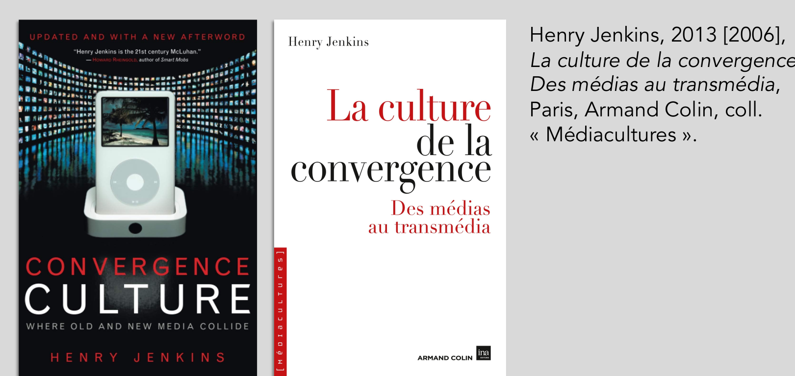
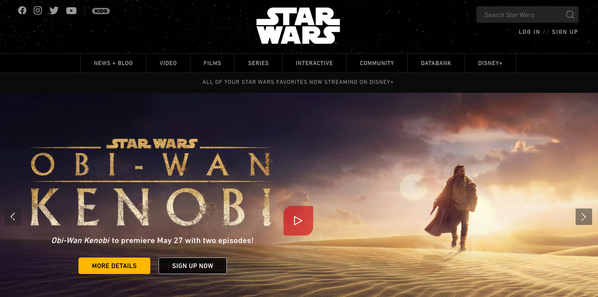
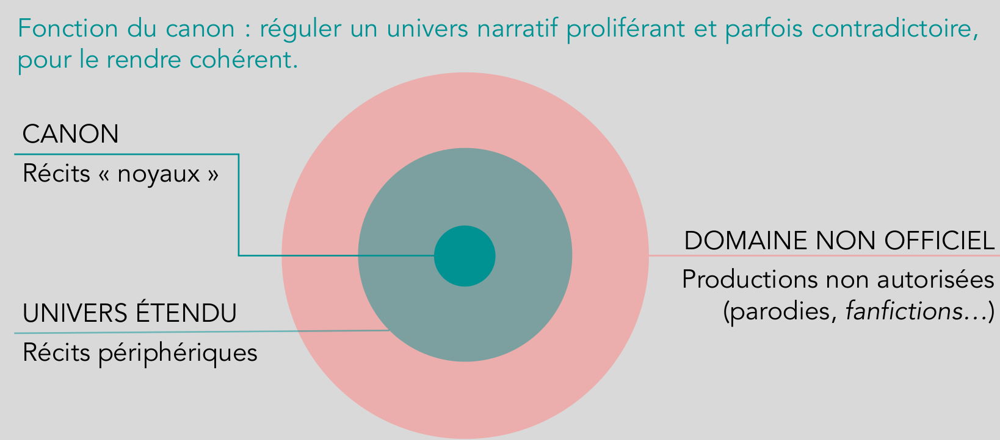
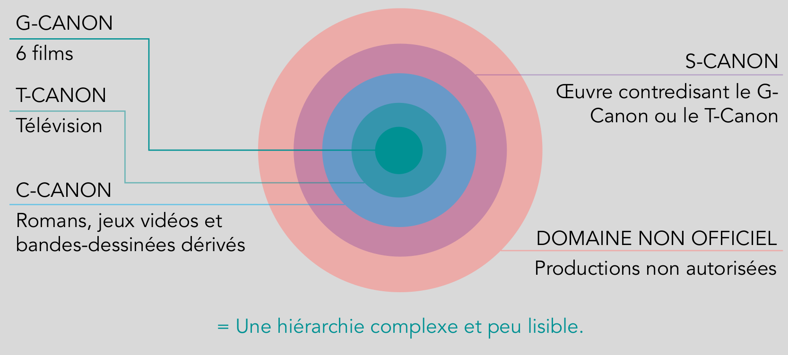
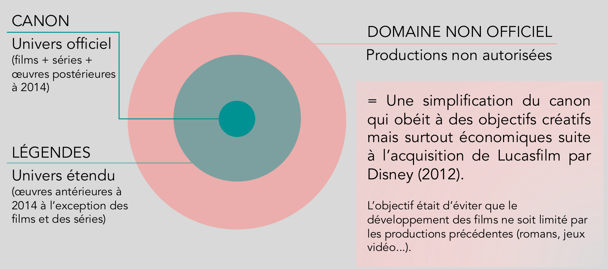
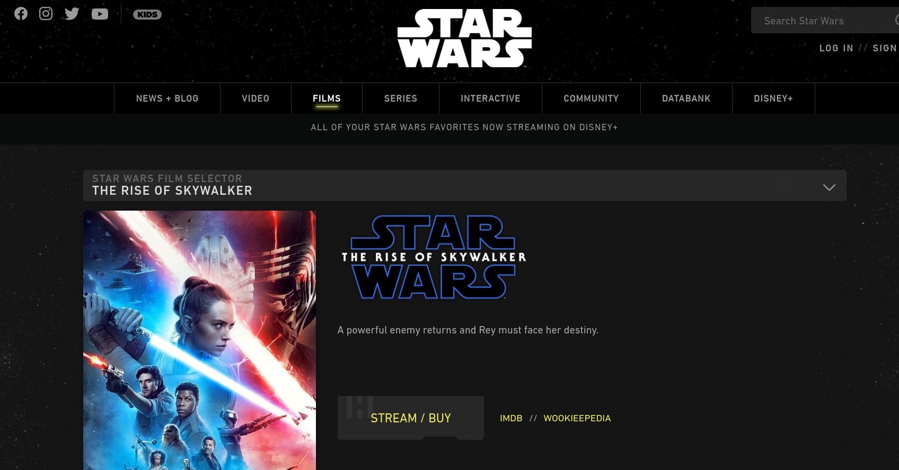
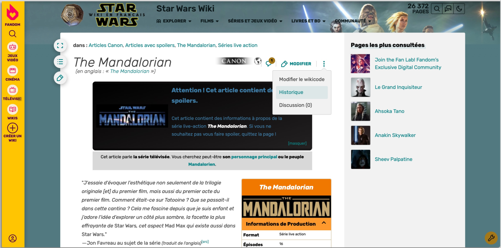

<!-- .slide: data-background-image="img/" data-background-size="contain" -->
<!-- .slide: class="hover"-->

# Le pouvoir au public ?

*Analyse du dispositif transmédiatique Star Wars*

§§§§§§§§§§§§§§§§§§§§§§§§§§§§§§§§§§§§§§§§§§§§§
<!-- .slide: data-background-video="img/Star_Wars_ A Transmedia_Story.mp4" data-background-size="contain" -->

Source : Alexander Mastronardi ["Star Wars: A Transmedia Story"](https://www.youtube.com/watch?v=hUP_GmB9W1s)

<!-- .element: class="source" -->

§§§§§§§§§§§§§§§§§§§§§§§§§§§§§§§§§§§§§§§§§§§§§

### Problématique : le transmédia peut-il ramener l'équilibre dans la galaxie des industries culturelles de masse ?
*Quel est le pouvoir effectif des publics contemporains?*

§§§§§§§§§§§§§§§§§§§§§§§§§§§§§§§§§§§§§§§§§§§§§

### Star Wars, a transmedia story ?

* Quelle a été votre "porte d'entrée" dans la saga *Star Wars* ?
* Pouvez-vous justifier la nature transmédiatique de *Star Wars*
* Toutes les productions *Star Wars* se valent-elles selon vous ?
* Êtes-vous fan de cette franchise transmédiatique (ou d'une autre) ?

<!-- .element: style="font-size:1.8rem" -->

§§§§§§§§§§§§§§§§§§§§§§§§§§§§§§§§§§§§§§§§§§§§§
<!-- .slide: data-background-video="img/starWarsItems.mp4" data-background-size="contain" -->

§§§§§§§§§§§§§§§§§§§§§§§§§§§§§§§§§§§§§§§§§§§§§

### La leçon de Master Henry Jenkins : converger tu devras

===
Henry Jenkins : chercheur et essayiste, se spécialise dans l’étude des nouveaux médias.

Titre original en anglais, Convergence culture : Where old and new media collide devient La Culture de la convergence. Des médias au transmédia. Publié en 2006, traduit en 2013.

Livre écrit en 2006, avant l’avènement du web social, qui a encore amplifié la visibilité des cultures fans. Henry Jenkins s’applique à expliquer avec des analyses de cas abondantes la façon dont la communication à l’ère de la convergence des médias est un axe central qui co-détermine le mouvement de la société. Il s’intéresse à des objets très divers : la téléréalité (American Idol, Survivor), les jeux vidéo, le nouveau cinéma participatif (Matrix, Harry Potter), les élections américaines de 2004, lors desquelles le numérique joue un rôle fondamental.

§§§§§§§§§§§§§§§§§§§§§§§§§§§§§§§§§§§§§§§§§§§§§

<iframe width="560" height="315" src="https://www.youtube.com/embed/RAA0ts-lYG0" title="YouTube video player" frameborder="0" allow="accelerometer; autoplay; clipboard-write; encrypted-media; gyroscope; picture-in-picture" allowfullscreen></iframe>

§§§§§§§§§§§§§§§§§§§§§§§§§§§§§§§§§§§§§§§§§§§§§

>Par convergence, j’entends le flux de contenu passant par différentes plateformes médiatiques, la coopération entre une multitude d’industries médiatiques et le comportement migrateur des publics des médias qui, dans leur quête d’expériences de divertissement qui leur plaisent, vont et fouillent partout. La convergence est un mot qui permet de décrire les évolutions technologiques, industrielles, culturelles et sociales en fonction de qui parle et de ce dont les locuteurs croient parler.

>(Jenkins 2013 [2006] : 22)

<!-- .element: style="font-size:1.8rem" -->

===

La convergence des médias, ici conceptualisée dans ses paramètres non seulement technologiques mais surtout culturels, sociaux et, aussi, politiques, est considérée comme un changement de paradigme pour comprendre l’évolution médiatique et ses usages divers. Un paradigme qui va à l’encontre du concept de « révolution numérique », dominant durant les années 90 et qui se résume en gros à l’idée de succession médiatique : idée les anciens médias sont rendus obsolètes par les nouveaux. Inversement, l’idée développée dans l’ouvrage d’Henry Jenkins part de l’hypothèse d’interaction complexe entre anciens et nouveaux médias, produisant des entrelacs culturels et sociaux différents de ceux auxquels le public était habitué. Les anciens médias ne meurent pas, ils évoluent vers d’autres formes : exemple, cassette vidéo évolue vers le DVD => forme différente, mais usage proche. De façon qui peut à première vue paraître paradoxale, la notion de convergence s’éloigne de l’idée de construction d’un hyper média puissant, rassemblant toutes les fonctions médiatiques. Dès l’introduction (pp. 21-43), l’auteur exprime son désaccord « avec l’idée que la convergence doive être entendue comme un processus technologique qui rassemblerait les multiples fonctions médiatiques dans un même appareil. La convergence est, au contraire, un changement d’ordre culturel […]. La convergence […] se produit dans le cerveau du consommateur et dans ses interactions sociales avec autrui » (p. 23). Idée selon laquelle « la convergence est un processus, pas un point final » (p. 35). Il n’y a pas d’« uni-média » ou de « super média », mais plutôt un empilement technologique, qui se vérifie avec la multiplicité des objets que nous utilisons au quotidien : téléphones, smartphones, télévisions, ordinateurs, tablettes, cinéma, livres, etc. La convergence préexiste au numérique, mais se radicalise avec ce dernier. Il ne faut donc pas se focaliser sur la convergence technologique, qui n’est qu’une composante de la convergence.

§§§§§§§§§§§§§§§§§§§§§§§§§§§§§§§§§§§§§§§§§§§§§

La convergence est définie :   

• selon des paramètres non seulement technologiques mais surtout culturels, sociaux et, aussi, politiques   
• comme un changement de paradigme pour comprendre l’évolution médiatique et ses usages divers

§§§§§§§§§§§§§§§§§§§§§§§§§§§§§§§§§§§§§§§§§§§§§

### « [La] convergence est un processus, pas un point final »

L’analyse de Jenkins s’oppose au concept de « révolution numérique », dominant durant les années 90 (idée les anciens
médias sont rendus obsolètes par les nouveaux). Selon lui, il n’existe pas d’hyper média puissant, rassemblant toutes les
fonctions médiatiques, mais plutôt un empilement technologique.
Il exprime son désaccord « avec l’idée que la convergence doive être entendue comme un processus technologique qui
rassemblerait les multiples fonctions médiatiques dans un même appareil. La convergence est, au contraire, un changement d’ordre culturel […]. La convergence […] se produit dans le cerveau du consommateur et dans ses interactions sociales avec autrui&nbsp;» (p. 23).

<!-- .element: style="font-size:1.9rem ; align:justify" -->

§§§§§§§§§§§§§§§§§§§§§§§§§§§§§§§§§§§§§§§§§§§§§

La convergence médiatique se traduit d’une part par une coordination des différents médias, d’autre part par la
participation des publics, ce que Jenkins nomme la «&nbsp;culture participative&nbsp;».

§§§§§§§§§§§§§§§§§§§§§§§§§§§§§§§§§§§§§§§§§§§§§

### Convergence commerciale + sociale

>La convergence […] est à la fois un système allant du haut vers le bas, dirigé par l’industrie, et un processus qui va du bas vers le haut, à l’initiative du consommateur. La convergence commerciale coexiste avec la convergence sociale. (Jenkins 2013 [2006] : 38).

<!-- .element: style="font-size:1.8rem" -->

===

§§§§§§§§§§§§§§§§§§§§§§§§§§§§§§§§§§§§§§§§§§§§§

### Du *top-down* au *bottom-up*

* De haut en bas, « top-down » : idéal d’un récit qui circulerait d’un média à un autre en étant orchestré par une
organisation, avec une stratégie centralisée
* De bas en haut, « bottom-up » : communautés participatives qui se réapproprient les œuvres

===

§§§§§§§§§§§§§§§§§§§§§§§§§§§§§§§§§§§§§§§§§§§§§
<!-- .slide: data-background-image="img/topdownbottomup.jpg" data-background-size="contain" -->

===

• De haut en bas, « top-down » : entreprises culturelles cherchent à fidéliser les publics en créant le « buzz », développement de nouvelles méthodes de marketing fondées sur l’expérience des usagers. Idéal d’un récit qui circulerait d’un média à un autre en étant orchestré par une organisation, avec une stratégie centralisée.  
• De bas en haut, « bottom-up » : communautés participatives qui se réapproprient les œuvres. Pas de centralisation : va dans le sens de la dispersion, pas forcément au profit des entreprises.  

§§§§§§§§§§§§§§§§§§§§§§§§§§§§§§§§§§§§§§§§§§§§§

### [Notion 1]  Le storytelling transmedia

> un processus à travers lequel les éléments d’une fiction sont dispersés sur plusieurs plateformes médiatiques dans le but de créer une expérience de divertissement coordonnée et unifiée. (Henry Jenkins, 2007, « Transmedia Storytelling 101 », Confessions of an Aca-fan.)

<!-- .element: style="font-size:1.8rem" -->

===
Jenkins définit le storytelling transmédia comme « un processus à travers lequel les éléments d’une fiction sont dispersés sur plusieurs plateformes médiatiques dans le but de créer une expérience de divertissement coordonnée et unifiée1 » (2007 : §2)

Développement du storytelling transmédia = indissociable du fait qu’il est devenu indispensable pour les producteurs de contenus médiatiques de faire sans les récepteurs, qui ne se contentent plus de réagir, de s’approprier et de détourner les messages informationnels et les œuvres de divertissement, mais qui s’impliquent parfois dès le stade de la production.

§§§§§§§§§§§§§§§§§§§§§§§§§§§§§§§§§§§§§§§§§§§§§

>Il est possible de trouver des formes précoces de transmédia qui sont antérieures à l’émergence de l’informatique en réseau et au divertissement interactif. Je ne suis pas préoccupé par la « nouveauté » du transmédia. La pression actuelle en faveur du transmédia a émergé de changements dans les pratiques de production (dans certains cas en lien avec la concentration des médias) ou dans les pratiques de réception (avec l’émergence du Web 2.0 et des médias sociaux), mais elle est également le résultat de l’apparition de nouvelles formes de compréhension esthétique de la façon dont fonctionnent les textes populaires qui est en partie liée à l’accession des geeks et des fans à des postes de pouvoir dans les industries du divertissement. (Jenkins 2011, trad. Baroni 2017)

<!-- .element: style="font-size:1.8rem" -->

===

Jenkins rappelle que l’impact du numérique n’est pas l’unique facteur expliquant la convergence entre producteurs et récepteurs :

>Il est possible de trouver des formes précoces de transmédia qui sont antérieures à l’émergence de l’informatique en réseau et au divertissement interactif. Je ne suis pas préoccupé par la « nouveauté » du transmédia. La pression actuelle en faveur du transmédia a émergé de changements dans les pratiques de production (dans certains cas en lien avec la concentration des médias) ou dans les pratiques de réception (avec l’émergence du Web 2.0 et des médias sociaux), mais elle est également le résultat de l’apparition de nouvelles formes de compréhension esthétique de la façon dont fonctionnent les textes populaires qui est en partie liée à l’accession des geeks et des fans à des postes de pouvoir dans les industries du divertissement. (Jenkins 2011, trad. Baroni 2017)

§§§§§§§§§§§§§§§§§§§§§§§§§§§§§§§§§§§§§§§§§§§§§

>Matrix, c’est le divertissement à l’âge de la convergence médiatique, qui intègre une multitude de textes pour créer un récit si vaste qu’il ne peut suffire à un seul média. Les [sœurs] Wachowski ont su parfaitement jouer le jeu du multimédia, produisant d’abord le film afin de stimuler l’intérêt du public, diffusant quelques comics sur le web pour alimenter la soif d’information des fans, sortant en même temps le jeu vidéo pour surfer sur la publicité, donnant une conclusion à l’ensemble du cycle avec Matrix Revolutions, puis livrant la totalité de la mythologie de cet univers à la multitude des joueurs en ligne. (Jenkins 2013 [2006] : 119)

<!-- .element: style="font-size:1.8rem" -->

===

Pour Jenkins, Matrix, dont le premier film est sorti en 1999, a joué un rôle pionnier dans le développement de ce phénomène :

Matrix, c’est le divertissement à l’âge de la convergence médiatique, qui intègre une multitude de textes pour créer un récit si vaste qu’il ne peut suffire à un seul média. Les [sœurs] Wachowski ont su parfaitement jouer le jeu du multimédia, produisant d’abord le film afin de stimuler l’intérêt du public, diffusant quelques comics sur le web pour alimenter la soif d’information des fans, sortant en même temps le jeu vidéo pour surfer sur la publicité, donnant une conclusion à l’ensemble du cycle avec Matrix Revolutions, puis livrant la totalité de la mythologie de cet univers à la multitude des joueurs en ligne. (Jenkins 2013 [2006] : 119)

§§§§§§§§§§§§§§§§§§§§§§§§§§§§§§§§§§§§§§§§§§§§§

### [Notion 2]   Le *world-building*

>Le storytelling est devenu, de plus en plus, l’art de construire un monde – car les artistes créent des environnements convaincants qui ne peuvent être correctement explorés ou épuisés dans une seule œuvre ou un seul média. L’univers est plus grand que le film, plus grand même que la franchise – car les spéculations et les élaborations des fans étirent ce monde dans de multiples directions. (Jenkins 2013 [2006] : 134-135)

<!-- .element: style="font-size:1.8rem" -->

===

Les différents dispositifs sont idéalement interdépendants, marquant l’abolition des frontières narratives entre les médias dans le cadre du récit transmédiatique. Mais dans les faits, persistance d’une hiérarchie entre les supports. Maintien d’une forme de hiérarchie entre les différents produits : on peut regarder les films Matrix sans jouer aux jeux vidéo, mais certains éléments de l’intrigue resteront flous si on joue aux jeux sans voir les films.

§§§§§§§§§§§§§§§§§§§§§§§§§§§§§§§§§§§§§§§§§§§§§

* Idéalement : interdépendance des différents dispositifs  
* En pratique : persistance d’une hiérarchie entre les dispositifs

===

Développement de franchises, qui centralisent et normalisent les productions liées à un univers donné régi par une marque déposée (trademark en anglais). Exemples ? Star Wars, Star Trek, Marvel, etc. En effet, dans le contexte d’une économie globalisée, les franchises sont souvent développées au sein de conglomérats qui en détiennent la propriété intellectuelle. Les droits des personnages et des différentes œuvres appartiennent alors à la franchise et non au créateur : il s’agit bien de marques à part entière, dont l’usage est régulé par le trademark; les considérations économiques priment dès lors sur les considérations artistiques. Dans ce contexte, la mise en place d’un univers de fiction coordonné résulte de lourdes opérations commerciales et juridiques.

Les franchises peuvent se mettre en place après la production des premiers récits (comme c’est le cas pour Harry Potter, dont le succès a largement dépassé les attentes de l’autrice), ou être planifiées à l’avance (Matrix, l’Univers Cinématographique Marvel.)

§§§§§§§§§§§§§§§§§§§§§§§§§§§§§§§§§§§§§§§§§§§§§

### ATELIER

Naviguez sur le Wiki français de Star Wars et sur le site officiel Starwars.com. Faites quelques recherches pour répondre aux questions suivantes :
1. Qu’est-ce qu’un fandom ?  
2. Qu’est-ce qu’un wiki ? En quoi les wikis sont-ils exemplaires de la « culture participative » analysée par Jenkins ?  
3. Observez-vous une hiérarchie entre les différents médias qui composent le monde fictionnel de Star Wars ?   
4. Quelle est la différence entre « Canon » et « Légendes » (dans « Romans Canon » et « Romans Légendes » par exemple) ? Pourquoi une telle distinction a-t-elle été établie ?   
5. Comparez le Wiki français et le site officiel de Star Wars : en quoi ces deux sites sont-ils représentatifs des mouvements top-down et bottom-up ?

<!-- .element: style="font-size:1.8rem" -->

§§§§§§§§§§§§§§§§§§§§§§§§§§§§§§§§§§§§§§§§§§§§§
<!-- .slide: data-background-image="img/fandom.png" data-background-size="contain" -->

§§§§§§§§§§§§§§§§§§§§§§§§§§§§§§§§§§§§§§§§§§§§§

### Les fandoms

1. Les fandoms sont des communautés de fans qui partagent une passion pour un objet commun et qui se livrent à diverses pratiques autour de celui-ci (discussions, participation à des rassemblements ou à des conventions, cosplay…)  
2. Dans le contexte numérique, les fandoms désignent les lieux qui centralisent les activités créatives et collaboratrices des fans sur Internet  
3. FANDOM est une plateforme qui rassemble des wikis consacrés à la culture médiatique et tenus par des fans  

<!-- .element: style="font-size:1.8rem" -->

§§§§§§§§§§§§§§§§§§§§§§§§§§§§§§§§§§§§§§§§§§§§§

### Les wikis
* Qu’est-ce qu’un wiki ?
* En quoi les wikis sont-ils exemplaires de la « culture participative » analysée par Jenkins ?

===

Les wikis ont transformé les fandoms : ils ont permis de formaliser et de rendre visible leur activité. Ils prennent généralement une forme encyclopédique.

Ils sont dotés d’un nom : par exemple, Star Wars Wiki pour le wiki francophone de Star Wars, Wookieepedia pour son wiki anglophone.

§§§§§§§§§§§§§§§§§§§§§§§§§§§§§§§§§§§§§§§§§§§§§
<!-- .slide: data-background-image="img/wikiDEF.png" data-background-size="contain" -->

§§§§§§§§§§§§§§§§§§§§§§§§§§§§§§§§§§§§§§§§§§§§§

* L’accès aux wikis est libre et gratuit. Tout le monde est autorisé à participer à la rédaction et à la correction des pages, à condition de respecter le règlement de la communauté et les conventions de mise en page et de style
* Les wikis reposent sur la transparence : les traces de création et de transformation des différentes pages sont accessibles aux utilisateur·rice·s
* Leur fonctionnement est émergent et « bottom-up » (de bas en haut) : ils évoluent en fonction des contributions des fans, les pages sont généralement édités à différentes reprises par de multiples auteur·rice·s. On parle ainsi d’intelligence collective
* Les pages sont relativement anonymes : les auteur·rice·s ne sont pas crédité·e·s pour leurs contributions, qui ne sont visibles que dans l’historique

<!-- .element: style="font-size:1.8rem" -->

§§§§§§§§§§§§§§§§§§§§§§§§§§§§§§§§§§§§§§§§§§§§§
<!-- .slide: data-background-image="img/starwarswiki1.png" data-background-size="contain" -->

===

Culture participative

§§§§§§§§§§§§§§§§§§§§§§§§§§§§§§§§§§§§§§§§§§§§§
<!-- .slide: data-background-image="img/starwarswiki2.png" data-background-size="contain" -->

===

Les wikis reposent sur la transparence : les traces de création et de transformation des différentes pages sont accessibles aux utilisateur·rice·s

§§§§§§§§§§§§§§§§§§§§§§§§§§§§§§§§§§§§§§§§§§§§§
<!-- .slide: data-background-image="img/starwarswiki3.png" data-background-size="contain" -->

===

Leur fonctionnement est émergent et « bottom-up » (de bas en haut) : ils évoluent en fonction des contributions des fans, les pages sont généralement édités à différentes reprises par de multiples auteur·rice·s. On parle ainsi d’intelligence collective
* Les pages sont relativement anonymes : les auteur·rice·s ne sont pas crédité·e·s pour leurs contributions, qui ne sont visibles que dans l’historique

§§§§§§§§§§§§§§§§§§§§§§§§§§§§§§§§§§§§§§§§§§§§§

### Observez-vous une hiérarchie entre les différents médias qui composent le monde fictionnel de Star Wars ?  

===

Même dans le cas de Star Wars, qui est peut-être l’exemple qui pousse le plus loin la logique du récit transmédiatique, persiste une hiérarchie entre les différents supports (puisqu’il s’agit de ménager pour le grand public la possibilité de choisir un point d’entrée, mais également un point de sortie satisfaisant) ainsi qu’entre les différentes intrigues (récit noyau vs. récits périphériques) : ce sont les films qui sont considérés comme la référence de toutes les autres œuvres, car le cinéma demeure le support le plus consensuel et donc le plus rentable.

Mais la consommation de séries a considérablement augmenté depuis une dizaine d’années + lancement de plateformes de vidéos à la demande => Depuis le lancement de Disney +, les séries gagnent en importance au sein du canon, ce qui se traduit notamment par une augmentation de leur budget, des campagnes publicitaires plus développées etc.

§§§§§§§§§§§§§§§§§§§§§§§§§§§§§§§§§§§§§§§§§§§§§

• Le cinéma demeure le média dominant (récit « noyau » = la Saga Skywalker)   
• Mais depuis le lancement de Disney+ en 2018, les séries tendent à gagner en importance au sein du canon (augmentation de leur budget, battage publicitaire…)   

§§§§§§§§§§§§§§§§§§§§§§§§§§§§§§§§§§§§§§§§§§§§§

### Quelle est la différence entre « Canon » et « Légendes » (dans « Romans Canon » et « Romans Légendes » par exemple) ? Pourquoi une telle distinction a-t-elle été établie ?   

§§§§§§§§§§§§§§§§§§§§§§§§§§§§§§§§§§§§§§§§§§§§§
<!-- .slide: data-background-image="img/canonLegende.png" data-background-size="contain" -->

===

Commenter extrait des fiches Wiki.

§§§§§§§§§§§§§§§§§§§§§§§§§§§§§§§§§§§§§§§§§§§§§
<!-- .slide: data-background-image="img/saintGelais.png" data-background-size="contain" -->

===

Lire passage de Saint-Gelais. Problème: difficultés à réguler un univers fictionnel proliférant, et qui comprend parfois des contradictions => rôle du canon.

§§§§§§§§§§§§§§§§§§§§§§§§§§§§§§§§§§§§§§§§§§§§§

### Canon / domaine officiel / domaine non-officiel

===

Commenter schémas.

G-canon « Georges Lucas canon », englobant les 6 films
T-canon « Television canon », principalement occupé par The Clone Wars
C-canon « Continuity canon », l’ensemble des œuvres dérivés
S-canon « Secondary canon », les très vielles œuvres, comme les comics Marvel des années 80
N-canon « Non canon », qui comprend toutes les œuvres sous licences qui ne font pas parti du canon, comme LEGO Star Wars

§§§§§§§§§§§§§§§§§§§§§§§§§§§§§§§§§§§§§§§§§§§§§

### Le canon Star Wars avant 2014: l'holocron

===

Suite à l’acquisition de Lucasfilm par Disney en 2012, et à la programmation d’un sequel des épisodes iv, v et vi, le nouveau groupe a annoncé en avril 2014 le remplacement de l’« Univers étendu » par « Star Wars Légendes », qui prend le relais de la continuité. Ainsi, tous les récits préalables qui se situent dans cette même période, et qui entrent ainsi en contradiction avec le scénario de la trilogie en cours, se trouvent de fait exclus du domaine canonique, quand bien même ils étaient régis par le trademark (ce procédé est appelé retcon, ou continuité rétroactive).

§§§§§§§§§§§§§§§§§§§§§§§§§§§§§§§§§§§§§§§§§§§§§

### Le canon Star Wars depuis 2014

===

§§§§§§§§§§§§§§§§§§§§§§§§§§§§§§§§§§§§§§§§§§§§§
<!-- .slide: data-background-image="img/canon4.png" data-background-size="contain" -->

§§§§§§§§§§§§§§§§§§§§§§§§§§§§§§§§§§§§§§§§§§§§§
<!-- .slide: data-background-image="img/universStarWars.png" data-background-size="contain" -->

§§§§§§§§§§§§§§§§§§§§§§§§§§§§§§§§§§§§§§§§§§§§§

### Comparez le Wiki français et le site officiel de Star Wars : en quoi ces deux sites sont-ils représentatifs des mouvements top-down et bottom-up ?

§§§§§§§§§§§§§§§§§§§§§§§§§§§§§§§§§§§§§§§§§§§§§

* Un site web qui pousse à consommer

§§§§§§§§§§§§§§§§§§§§§§§§§§§§§§§§§§§§§§§§§§§§§

* Un site web qui pousse à créer

§§§§§§§§§§§§§§§§§§§§§§§§§§§§§§§§§§§§§§§§§§§§§

### Conclusion

À l'heure où les franchises médiatiques battent leur plein, le transmédia peut-il vraiment ramener l'équilibre dans la galaxie des industries culturelles de masse ? Oui et non. On note en effet, de la part des grands groupe médiatiques, la volonté de contrôler le plus possible les productions parallèles, en structurant le canon de leur univers transmédia -- quitte à se réapproprier des productions alternatives. Le public semble quant à lui naviguer entre cet univers relativement bridé, et la possibilité / l'envie de forger ses propres créations. Une chose est certaine : en régime numérique, le profil du "fan" a énormément changé. Il n'est plus cet animal passif, manipulé par les médias, mais bien un acteur à part entière d'un univers fictionnel, à partir duquel il est invité non seulement à rêver, mais également à créer.

<!-- .element: style="font-size:1.8rem" -->
